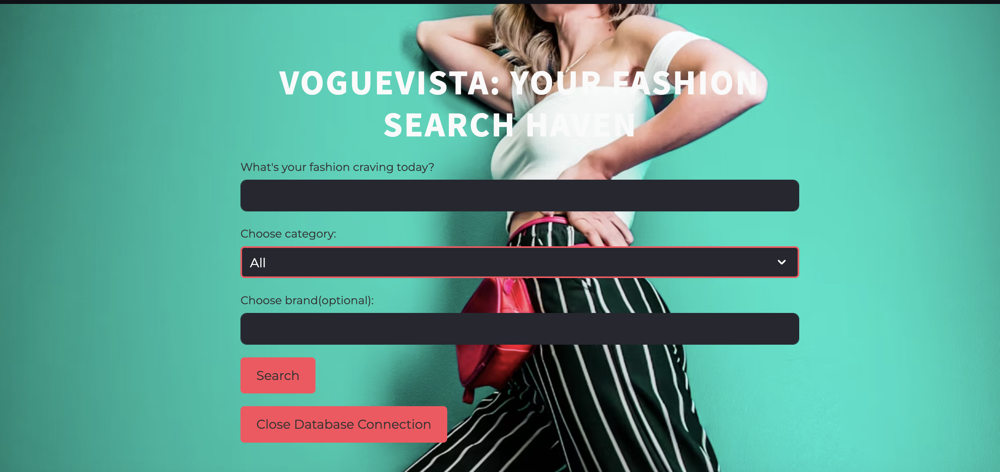
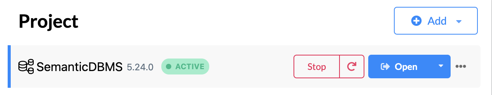

# 👔 VogueVista: Fashion Search Haven

VogueVista is a fashion search tool that blends semantic search, query expansion, and knowledge graph integration to improve product discovery and recommendation features. Built with Streamlit, Sentence Transformers, and Neo4j, this project enables users to search for fashion products using natural language queries, with support for category and brand filters.

  

### Prerequisites

- Python 3.x
- Neo4j database instance 
- A `.env` file with the following variables:
   - NEO4J_URI=<your_neo4j_uri>
   - NEO4J_USER=<your_neo4j_username>
   - NEO4J_PASSWORD=<your_neo4j_password>

### Libraries

- **Streamlit**: Interactive UI for the search tool
- **SentenceTransformers**: Embedding-based semantic search with Sentence-BERT (SBERT) all-MiniLM-L6-v2
- **Neo4j**: Knowledge graph database
- **Pandas**: Data manipulation
- **NumPy**: Numerical computations
- **scikit-learn**: Cosine similarity computations

### Installation

```bash
git clone https://github.com/Betty987/Fashion-product-search.git
cd Fashion-product-search
```

### Set Up Virtual Environment

```bash
python -m venv venv
source venv/bin/activate  # On Windows: venv\Scripts\activate
pip install -r requirements.txt
```


### Dependencies

Install the required dependencies using the following command:

```bash
pip install -r requirements.txt
```

### Dataset

The dataset used in VogueVista, flipkart_fashion_products_dataset.json, is a collection of fashion product listings sourced from Flipkart, a popular Indian e-commerce platform.To optimize performance, the dataset is trimmed to the first 10,000 rows. The dataset includes the following fields:

- Add the dataset(flipkart_fashion_products_dataset.json) to the data folder inside the project folder-[flipkart_fashion_products_dataset.json](https://drive.google.com/file/d/16AmyCJbpEABIqT24ev5H_JgWwfzSMuku/view?usp=sharing)
- Add cached embeddings(embeddings_cache.json) to the project folder-[embeddings_cache.json](https://drive.google.com/file/d/1ZQ3DpxMR69r45yJT5vP1wp4ayg7sP9Ye/view?usp=sharing)

- `_id`: Unique product identifier
- `title`: Product title
- `description`: Product description
- `brand`: Product brand
- `category`: Product category
- `sub_category`: Product sub-category
- `images`: Image URLs
- `actual_price`: Original price
- `selling_price`: Discounted price
- `discount`: Discount percentage
- `average_rating`: Customer rating

### Neo4j Configuration

1. Download and install Neo4j: [Neo4j Download](https://neo4j.com/download/)
2. Start the Neo4j database and log in to the Neo4j Browser.
 
4. Import the knowledge graph data:
   - Open the Neo4j browser and run the provided Cypher commands to create nodes and relationships.

### Running the Application

1. Ensure Neo4j is running.
2. Start the Streamlit application:
   ```bash
   streamlit run main.py
   ```
3. Open your browser and navigate to the URL displayed in the terminal (e.g., `http://localhost:7687`).


### Workflow

1. Type in a search term (e.g., "white shirt").
2. Choose to narrow results by category or brand if desired.
3. Explore suggested products, complete with detailed descriptions and brand info.

### Model Insights
The web app utilizes Sentence Transformers (SBERT), a transformer-based model optimized for semantic similarity tasks. It transforms text into vector embeddings, enabling comparison through cosine similarity.

#### Why Choose SBERT?
1. Contextual Insight: SBERT grasps the deeper meaning of text, making it perfect for semantic search applications.
2. Performance: It offers computational efficiency in creating embeddings and assessing them with cosine similarity.
3. Ready-to-Use Models: Pretrained models trained on varied datasets eliminate the need for extensive custom training.

### Knowledge Graph Integration

The knowledge graph uses Neo4j to model relationships between entities, such as:

- `Keyword`: Represents search terms.
- `RELATED_TO`: Relationship between keywords and their synonyms or related concepts.

### Sample Cypher Queries


1. Add and relate keywords:
   ```cypher
     CREATE (k1:Keyword {name: 'shirt'})-[:RELATED_TO]->(k2:Keyword {name: 'top'}),
       (k1)-[:RELATED_TO]->(k3:Keyword {name: 'blouse'}),
       (k4:Keyword {name: 'shoes'})-[:RELATED_TO]->(k5:Keyword {name: 'footwear'})
   ```
2. Query synonyms:
   ```cypher
   MATCH (k:Keyword)-[:RELATED_TO]->(related)
   RETURN k.name, related.name
   ```

### File Structure

```
.
├── main.py                  # Main Streamlit application
├── data/
│   └── flipkart_fashion_products_dataset.json
├── embeddings_cache.json   # Cached embeddings
├── requirements.txt        # dependencies
├── README.md               # documentation
```
### Demo
[Demo](https://drive.google.com/file/d/12i6b-zmHwhwfYJXOHz2tr09oiyGpzNhN/view?usp=sharing)


